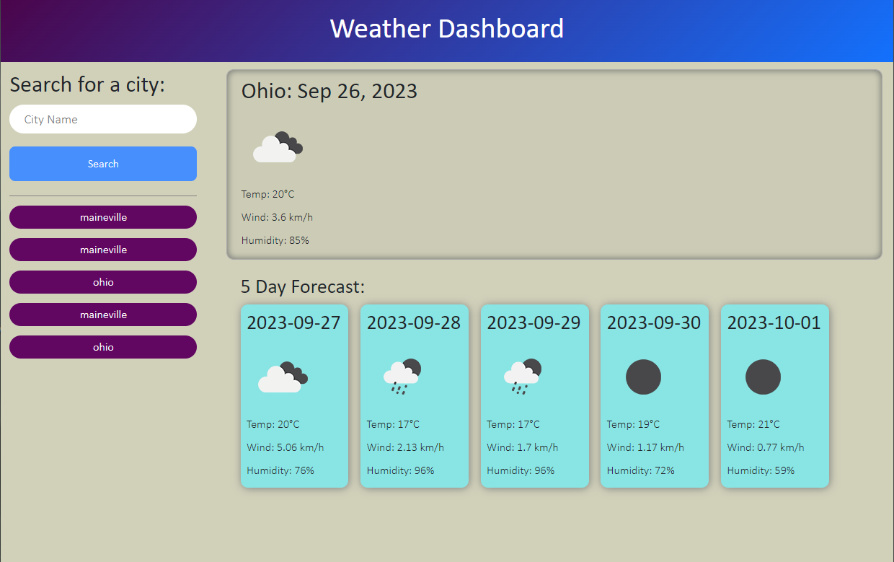

# About
This is Module 6 Challenge by the Ohio State University bootcamp. This project is about creating a Weather Dashboard that display the weather of the city the users enter.

## Description
When the user first entered the website, they'll see a search bar and search history on the left side, and Ohio's weather on the right side if there were no previous search history. At the top of the right side, the current weather will be displayed, while the 5 day forecast will be displayed right below it. 

## Screenshot of the website

## Link to the website
https://kaarageonigiri.github.io/Weather-Dashboard/